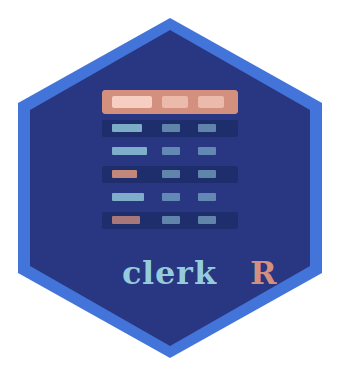

# 🧪 clerkR 

**A clerk keeps tabs — `clerkR` keeps yours publication-ready.**

[](./LICENSE)
[](https://cran.r-project.org/)
[](https://clerkr.circadia-lab.uk)

---

## 📖 What is clerkR?

`clerkR` transforms standard R data frames into publication-ready tables for
biomedical and neuroscience manuscripts. Rather than wrestling with formatting
each time, `clerkR` reduces the most common table types to a handful of
opinionated constructor functions that share consistent theming, domain
grouping, footnote handling, and a unified rendering pipeline for Word/PDF
(`gt`), interactive HTML (`reactable`), and LaTeX output.

## ✨ Features

- 📋 **Five table archetypes** covering ~90% of what appears in a biomed paper
- 🎨 **clerkR theme** — light teal headers, navy text, clean borders, consistent throughout
- 🗂️ **Domain/section grouping** — organise rows under labelled section headers
- 📝 **Automatic footnotes** for log-transformed variables and FDR correction
- 🖨️ **Three render targets** — `gt` for Word/PDF, `reactable` for HTML, LaTeX for manuscripts
- 🔢 **Output baked in at construction** — set `output = "gt"` once, then just `|> clerk_render()`
- 🔗 **R-itable compatible** — `herit_batch()` output pipes straight into `tbl_heritability()`
- 🧩 **Composable** — all constructors return a `clerk_tbl` S3 object

## 📋 Table archetypes

| Function | Use case | Example |
|---|---|---|
| `tbl_descriptive()` | Sample characteristics by group, mean ± SD, t/χ² | Table 1 |
| `tbl_simple()` | Descriptive summary, no inferential test | Supplementary table |
| `tbl_correlation()` | Partial correlations, r, p, p† | Correlation results |
| `tbl_regression()` | β, SE, 95% CI, p, FDR — accepts `broom::tidy()` | Linear/logistic models |
| `tbl_heritability()` | h², 95% CI, LRT p, σ²a/σ²e — accepts `herit_batch()` | Heritability results |

## 🚀 Getting Started

### Installation

```r
# clerkR
remotes::install_github("circadia-bio/clerkR")

# For the heritability workflow, also install R-itable
remotes::install_github("circadia-bio/R-itable")
```

### The one-two pattern

```r
library(clerkR)

tbl_descriptive(
  clerk_example,
  group   = sex,
  domains = list(
    "Metabolic"      = c("hdl", "glucose", "bmi"),
    "Anthropometric" = c("waist", "systolic_bp"),
    "Cognitive"      = c("tmt_time", "verbal_fluency"),
    "Mental health"  = c("bdi", "panas_neg", "life_satisfaction")
  ),
  log_vars = "tmt_time",
  fdr      = TRUE,
  output   = "gt"
) |>
  clerk_render(title = "Table 1. Sample characteristics by sex")
```

### Heritability from R-itable

```r
herit_batch(traits, grm = A, data = dat, covs_list = covs_list) |>
  tbl_heritability(
    model    = "covariates",
    sigma2_a = "sigma2_a",
    sigma2_e = "sigma2_e",
    fdr      = TRUE,
    output   = "gt"
  ) |>
  clerk_render(title = "Heritability estimates")
```

## 🎨 Colour palette

```r
clerk_palette()     # full named palette
clerk_diverging()   # terracotta → off-white → navy (9 steps)
clerk_sequential()  # near-white → navy (7 steps)
```

## 📦 Dependencies

| Package | Version | Purpose |
|---|---|---|
| `dplyr` | ≥ 1.1.0 | Data manipulation |
| `tidyr` | any | Reshaping |
| `rlang` | any | Tidy evaluation |
| `gt` | ≥ 0.10.0 | Word/PDF table rendering |
| `reactable` | ≥ 0.4.0 | Interactive HTML rendering |
| `knitr` | any | LaTeX output |
| `grDevices` | any | Colour ramps |

## 👥 Authors

| Role | Name |
|---|---|
| Author, maintainer | [Lucas França](https://orcid.org/0000-0003-0853-1319) |
| Author | [Mario Leocadio-Miguel](https://orcid.org/0000-0002-7248-3529) |

## 🤝 Related Tools

- 🕐 [**zeitR**](https://github.com/circadia-bio/zeitR) — actigraphy analysis and circadian metrics
- 📓 [**slumbR**](https://github.com/circadia-bio/slumbR) — sleep diary processing
- 📋 [**tallieR**](https://github.com/circadia-bio/tallieR) — questionnaire and sociodemographic data
- 🔗 [**syncR**](https://github.com/circadia-bio/syncR) — integrates zeitR, slumbR, and tallieR
- 🧬 [**R-itable**](https://github.com/circadia-bio/R-itable) — pedigree-based heritability estimation
- 🔬 [**circadia-bio**](https://github.com/circadia-bio) — the Circadia Lab GitHub organisation

## 📄 Licence

Released under the [MIT License](./LICENSE).

Copyright © Lucas França & Mario Leocadio-Miguel, 2026
